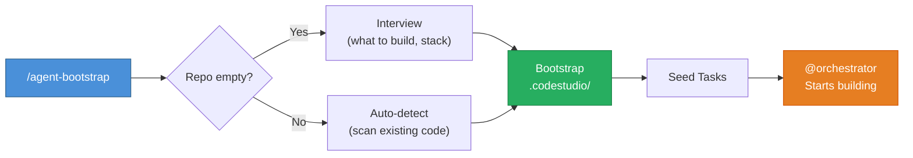
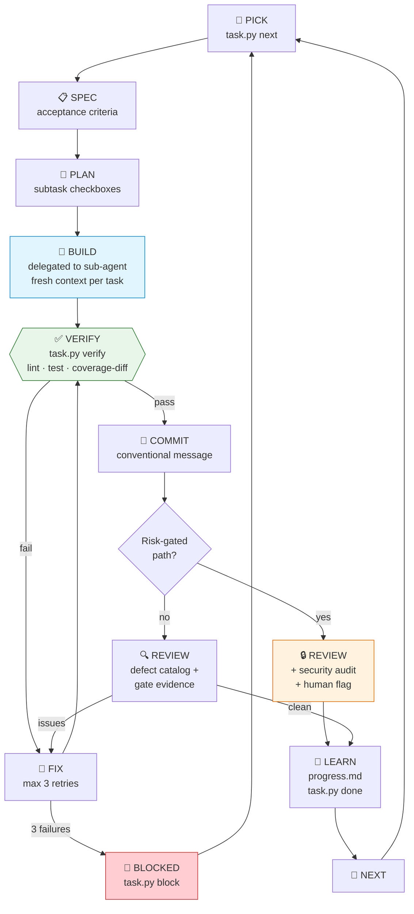
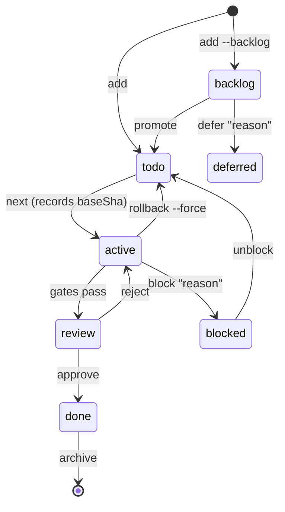
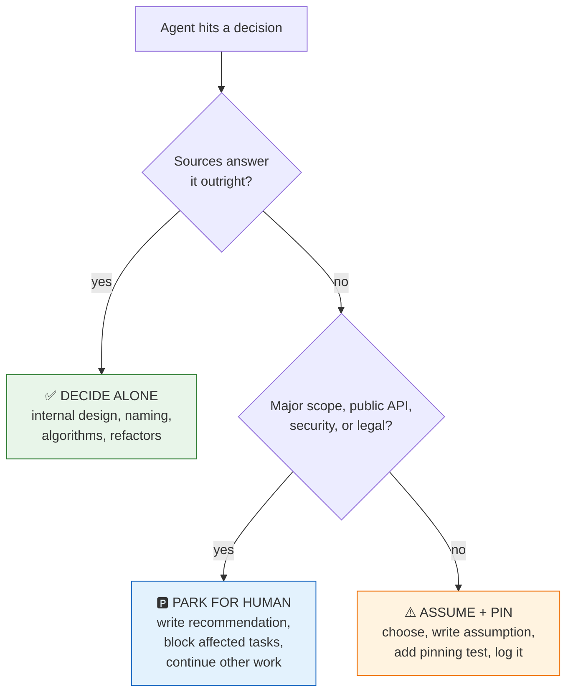
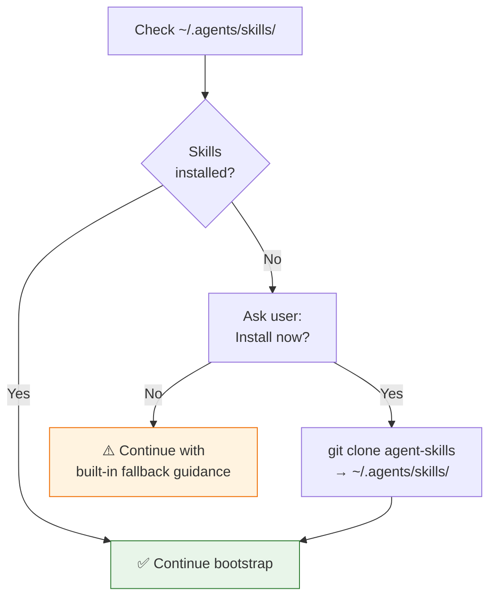

# Agent Bootstrap

A Code Studio skill that bootstraps any repository for fully autonomous AI-driven software development. One command takes a repo from zero to an agent-ready workspace with task management, evidence gates, and a loop protocol.

## What It Does

Point it at any repo (or an empty one) and it will:

1. **Scan + Assess** — detect stack, tools, conventions, and score readiness
2. **Bootstrap** — create `.codestudio/` harness with task management and orchestrator
3. **Handoff** — seed initial tasks and instruct the user to run `@orchestrator`

After bootstrap, the **orchestrator agent** takes over: creating tasks, planning features, building code, verifying with evidence gates, committing, reviewing, and repeating until the project is complete.

## How It Works



## Quick Start

```
/agent-bootstrap
```

For empty repos, the skill interviews you about what to build. For existing repos, it auto-detects everything.

After bootstrap:
```
@orchestrator Add user authentication with OAuth
```

The orchestrator decomposes the goal into tasks and builds them autonomously.

## Generated Output

```
your-project/
├── AGENTS.md                              # How AI agents work in this repo
└── .codestudio/
    ├── task.py                            # Task manager (16 commands)
    ├── gates.yaml                         # Evidence gates (lint, test, coverage)
    ├── harness-lock.json                  # Ratchet floors (quality only goes up)
    ├── .gitignore                         # Excludes evidence/ and coverage
    ├── agents/
    │   └── orchestrator.agent.md          # Development loop protocol
    ├── instructions/
    │   └── task-conventions.instructions.md
    ├── catalogs/
    │   └── defects-<framework>.md         # Framework-specific bug patterns
    ├── project-context.md                 # Stack, architecture, conventions
    ├── tasks/
    │   └── index.json                     # Task index (managed by task.py)
    ├── evidence/                          # Gate output per task (gitignored)
    └── progress.md                        # Session memory
```

## The Loop



| Stage | What Happens |
|-------|-------------|
| **PICK** | `task.py next` — get next eligible task (records baseSha for diff-scoping) |
| **SPEC** | Write acceptance criteria |
| **PLAN** | Break into subtask checkboxes |
| **BUILD** | Sub-agent implements (fresh context per task) |
| **VERIFY** | `task.py verify` — runs gates in parallel with ratchet enforcement |
| **COMMIT** | Atomic commit with conventional message |
| **REVIEW** | Code review against defect catalog + gate evidence (never re-checks what gates proved) |
| **LEARN** | Log decisions, update progress.md |
| **NEXT** | Loop back to PICK |

## Task States



## Three Modes

| Mode | Trigger | Behavior |
|------|---------|----------|
| **Empty repo** | No source files | Interview → setup → seed tasks |
| **Existing repo** | Source files found | Auto-detect → setup (respects existing configs) |
| **Upgrade** | `.codestudio/` exists | Update scripts, preserve tasks & progress |

## Evidence Gates

Quality gates that must pass before any task can be marked done:

- **exit-code gates**: build, lint, typecheck, format (pass/fail)
- **coverage gates**: line coverage ≥ threshold (global)
- **coverage-diff gates**: coverage of lines *this task changed* ≥ threshold (brownfield-friendly)
- **audit gates**: no high/critical vulnerabilities
- **Ratchet enforcement**: quality thresholds can never go down

### Diff-Scoped Coverage

The most important feature for existing repos. Instead of measuring global coverage (often 4% on legacy codebases), `coverage-diff` measures only the lines this task changed — enforceable at 80% from day one.

```
FAIL coverage-diff  diffLineRate=44.44%
     Add tests covering these changed lines:
         src/calc.py:12
         src/calc.py:16
```

## Autonomy Boundary

The orchestrator follows three decision lanes:



## The One Rule With No Exceptions

> **NEVER disable, weaken, skip, or delete a test, gate, or threshold to make a gate pass.**

This is the cheapest path for an agent told to make things green. The ratchet blocks threshold changes. This rule blocks everything else.

## SDLC Skills

The orchestrator uses SDLC skills from `~/.agents/skills/` at each loop stage (TDD, code review, security, etc.).

**During bootstrap**, the skill checks if these are installed and offers to auto-install them:



If skills are not installed, the orchestrator uses **built-in fallback guidance** — less detailed but functional. You can install skills anytime:

```bash
git clone https://github.com/addyosmani/agent-skills.git ~/.agents/skills
```

## Task Manager

```bash
python3 .codestudio/task.py next              # pick next task (records baseSha)
python3 .codestudio/task.py verify            # run gates, capture evidence
python3 .codestudio/task.py done              # mark complete (requires evidence)
python3 .codestudio/task.py add "title"       # new task
python3 .codestudio/task.py add "t" --needs T-001  # with dependency
python3 .codestudio/task.py block "reason"    # can't proceed
python3 .codestudio/task.py defer T-XXX "why" # defer backlog item with reason
python3 .codestudio/task.py rollback T-XXX    # dry run: show what's lost
python3 .codestudio/task.py rollback T-XXX --force  # execute rollback to baseSha
python3 .codestudio/task.py status            # project summary
python3 .codestudio/task.py list              # list all tasks
```
